```mermaid
graph TB
    A[🌐 Client Applications] --> B[🔥 Flask REST API]
    B --> C[🎯 Route Controllers]
    C --> D[📊 Calculation Engines]
    D --> E[🌍 Swiss Ephemeris]
    D --> F[📚 Astronomical Data]
    
    subgraph "Calculation Systems"
        G[🕉️ Lahiri System]
        H[🔮 KP System] 
        I[📜 Raman System]
    end
    
    C --> G
    C --> H
    C --> I
    
    E --> J[🗂️ Ephemeris Files]
    F --> J
```

# 🌟 Astro Engine - Comprehensive Vedic Astrology Calculation Backend

<div align="center">


**A production-ready, enterprise-grade astrological computation backend supporting multiple Vedic calculation systems with Swiss Ephemeris precision, advanced caching, and comprehensive monitoring.**


## 🧠 For New Developers - Start Here!

If you're new to this project, here's a quick orientation:

**What is Astro Engine?** This is a backend API server that performs complex Vedic astrology calculations. It takes birth details (date, time, location) and returns astrological charts and predictions using different systems (Lahiri, KP, and Raman).

**Tech Stack at a Glance:**
- 🐍 **Python** with Flask web framework
- 🌊 **Swiss Ephemeris** for astronomical calculations
- 🗄️ **Redis** for high-performance caching
- 📊 **Prometheus** for system monitoring
- 🔄 **Celery** for handling long-running tasks
- 🐳 **Docker** for containerization

**How to Get Started:**
1. Check the [Quick Start Guide](#-quick-start-guide) to run the project
2. Review the [Project Overview](#-project-overview) to understand the big picture
3. Explore the [Directory Structure](#-directory-structure) to learn about the codebase organization
4. See [Technical Implementation](#-technical-implementation) for detailed explanations of key components

**Key Files to Understand:**
- `astro_engine/app.py`: Main entry point for the Flask application
- `astro_engine/engine/routes/`: API endpoints for different astrological systems
- `astro_engine/cache_manager.py`: Redis caching implementation
- `astro_engine/metrics_manager.py`: Prometheus metrics collection

### Current Version: 1.3.0 (June 2025)

| Version | Release Date | Major Features |
|---------|-------------|----------------|
| **1.3.0** | June 2025 | Celery task queue integration, enhanced security features, Prometheus metrics |
| **1.2.0** | March 2025 | Redis caching system, structured logging, performance optimizations |
| **1.1.0** | December 2024 | Complete Raman system integration, additional divisional charts |
| **1.0.0** | September 2024 | Initial release with Lahiri and KP systems |

</div>

## 📋 Table of Contents

### 🏁 Getting Started
- [🔍 Project Overview](#-project-overview) - What is Astro Engine and what does it do?
- [🚀 Quick Start Guide](#-quick-start-guide) - Get the project running in minutes
- [💻 Development Environment Setup](#-development-setup) - Setting up your dev environment

### 📚 Understanding the Project
- [✨ Features](#-features) - Core capabilities and calculation systems
- [🏗️ Architecture & System Design](#️-architecture--system-design) - High-level system architecture
- [📊 Directory Structure](#-directory-structure) - Project organization explained
- [🧩 How Everything Fits Together](#how-everything-fits-together) - Understanding component interactions

### � API & Usage
- [�📡 API Documentation](#-api-documentation) - How to use the API
- [🎯 API Systems](#-api-systems) - Different astrological systems available
- [📖 Usage Examples](#-examples) - Sample requests and responses

### 🛠️ Technical Details
- [🔧 Technical Implementation](#-technical-implementation) - Detailed explanations of key components
- [� Redis Caching System](#️-redis-caching-system) - How caching works
- [📊 Prometheus Metrics System](#-prometheus-metrics-system) - Monitoring and performance
- [🔄 Celery Task Queue System](#-celery-task-queue-system) - Async processing

### 🚢 Deployment
- [🐳 Docker Deployment](#-docker-deployment) - Running with Docker
- [☁️ Cloud Deployment Options](#️-cloud-deployment-options) - Deploying to cloud providers

### 📈 Project Management
- [🔮 Future Roadmap](#-future-roadmap) - Planned enhancements
- [🧪 Testing](#-testing) - How to test the system
- [⚙️ Configuration](#-configuration) - Configuration options
- [📋 Changelog](#-changelog) - Version history
- [📄 License](#-license) - Licensing information
- [🆘 Support & Help](#-support--help) - Getting assistance
- [🙏 Acknowledgments](#-acknowledgments) - Credits

## 🔍 Project Overview

**Astro Engine** is a sophisticated **Python-based astrological computation backend** that provides comprehensive Vedic astrology calculations through a Flask REST API. It serves as a complete computational engine for astrological software, mobile applications, and web services, with enterprise-grade performance and reliability features.

### Core Capabilities
- **🎯 Multi-Ayanamsa Support**: Lahiri, KP (Krishnamurti), and Raman systems
- **📊 Complete Chart Systems**: Natal, Transit, Divisional (D1-D60), and specialized charts
- **⏰ Advanced Dasha Calculations**: 5-level Vimshottari system (Maha→Antar→Pratyantar→Sookshma→Prana)
- **🔮 KP Horary Astrology**: Question-based predictive calculations
- **🧮 Numerology Systems**: Chaldean, Lo Shu Grid, and compatibility analysis
- **📈 Ashtakavarga**: Comprehensive strength analysis systems
- **🔄 Synastry & Compatibility**: Relationship analysis between charts
- **📱 Mobile-Ready APIs**: Optimized endpoints for mobile applications
- **⚙️ Custom Calculations**: Flexible parameter support for specialized needs

### Technical Excellence
- **🌌 Swiss Ephemeris Integration**: Arc-second precision planetary calculations
- **🐳 Production Architecture**: Docker-ready with Gunicorn WSGI deployment
- **🔒 Enterprise Grade**: Comprehensive error handling and input validation
- **📈 Scalable Design**: Stateless REST API for horizontal scaling
- **⚡ Redis Caching**: High-performance calculation caching with analytics
- **📊 Prometheus Metrics**: Real-time performance monitoring and alerts
- **📝 Structured Logging**: Advanced tracing and diagnostic capabilities
- **⏱️ Celery Task Queue**: Asynchronous processing for complex calculations



## � Features

### Comprehensive Calculation Systems

The Astro Engine implements dozens of specialized astrological calculation systems:


### Performance Optimization Features

The system implements numerous performance optimizations to handle high-load production environments:

| Feature | Description |
|---------|-------------|
| **🚀 Redis Caching** | Multi-level caching system with intelligent TTL and automatic invalidation |
| **📊 Prometheus Metrics** | Real-time monitoring of system performance with 20+ custom metrics |
| **📝 Structured Logging** | JSON-formatted logs with context tracking and rotation |
| **⚡ Gunicorn Workers** | Optimized WSGI server with multiple worker processes |
| **🔄 Celery Task Queue** | Asynchronous processing for long-running calculations |
| **🗜️ Response Compression** | GZIP compression for bandwidth optimization |
| **⚖️ Load Balancing** | Support for horizontal scaling across multiple nodes |
| **🔍 Health Checks** | Comprehensive health monitoring for orchestration systems |

### Enterprise-Grade Security


### Supported Integrations

The API is designed to integrate seamlessly with various frontend and client applications:

- **🌐 Web Applications**: Modern SPAs and traditional web applications
- **📱 Mobile Applications**: Native iOS/Android apps through REST API
- **🖥️ Desktop Software**: Integration with desktop astrology software
- **🤖 Third-party Services**: Integration with other astrology platforms
- **🔌 Webhooks**: Support for event-driven architectures
- **📊 Analytics Platforms**: Data export for BI and analytics

## �🏗️ Architecture & System Design

### High-Level Architecture

The Astro Engine is built on a multi-layered architecture designed for performance, reliability, and scalability. The system integrates Swiss Ephemeris for high-precision astronomical calculations with modern cloud-native technologies for enterprise-grade deployment.

```mermaid
flowchart TD
    subgraph "🌐 External Layer"
        Client[📱 Client Apps]
        Web[🌍 Web Apps]
        Mobile[📲 Mobile Apps]
        ThirdParty[🔌 3rd Party Services]
    end
    
    subgraph "�️ Gateway Layer"
        NGINX[NGINX Reverse Proxy]
        SSL[SSL/TLS Termination]
        RateLimit[Rate Limiting]
    end
    
    subgraph "�🔥 API Layer"
        Flask[Flask Application]
        Gunicorn[Gunicorn WSGI]
        CORS[CORS Handler]
        Routes[Route Blueprints]
        Metrics[Prometheus Metrics]
    end
    
    subgraph "🧠 Business Logic Layer"
        Lahiri[🕉️ Lahiri Engine]
        KP[🔮 KP Engine]
        Raman[📜 Raman Engine]
        Validation[Input Validation]
        ErrorHandling[Error Processing]
    end
    
    subgraph "📊 Calculation Layer"
        Natal[🌟 Natal Charts]
        Divisional[📊 Divisional Charts]
        Dasha[⏰ Dasha Systems]
        Lagna[🏠 Lagna Charts]
        Ashtaka[📈 Ashtakavarga]
        Numerology[🧮 Numerology]
    end
    
    subgraph "🗄️ Data Services"
        Redis[📦 Redis Cache]
        Celery[🔄 Celery Tasks]
    end

    subgraph "🌍 Data Layer"
        SwissEph[Swiss Ephemeris]
        EpheFiles[📁 Ephemeris Data]
        Algorithms[🔢 Mathematical Algorithms]
    end
    
    subgraph "📊 Monitoring Layer"
        Prometheus[Prometheus Metrics]
        Structured[Structured Logging]
        HealthChecks[Health Monitoring]
    end
    
    ThirdParty --> NGINX
    Client --> NGINX
    Web --> NGINX
    Mobile --> NGINX
    
    NGINX --> Flask
    Flask --> CORS
    Flask --> Routes
    Flask --> Metrics
    Flask --> Redis
    Flask --> Celery
    
    Routes --> Lahiri
    Routes --> KP
    Routes --> Raman
    Routes --> Validation
    
    Lahiri --> Natal
    Lahiri --> Divisional
    KP --> Dasha
    Raman --> Lagna
    
    Natal --> SwissEph
    Divisional --> SwissEph
    Dasha --> SwissEph
    Lagna --> SwissEph
    Ashtaka --> SwissEph
    Numerology --> Algorithms
    
    SwissEph --> EpheFiles
    
    Flask --> Prometheus
    Flask --> Structured
    Flask --> HealthChecks
```



### Project Structure Overview

Let's understand the project structure from both a high level and with specific detail. If you're new to the project, this will help you navigate the codebase effectively.

#### Directory Structure Visualization


#### Detailed Directory Map

```
Astro_Engine/                      # 🏠 Root project directory
│
├── astro_engine/                  # 📱 Core application code
│   │
│   ├── app.py                     # 🚀 Main application entry point
│   │                              #    Sets up Flask app, configures routes, middleware
│   │                              #    FIRST FILE TO READ to understand the system!
│   │
│   ├── cache_manager.py           # 🗄️ Redis caching implementation
│   │                              #    Handles all caching operations with Redis
│   │
│   ├── metrics_manager.py         # 📊 Prometheus metrics collection
│   │                              #    Collects and exposes performance metrics
│   │
│   ├── structured_logger.py       # 📝 Advanced JSON-based logging
│   │                              #    Handles structured logging with context
│   │
│   ├── celery_manager.py          # 🔄 Task queue manager
│   │                              #    Interfaces with Celery for async tasks
│   │
│   ├── celery_tasks.py            # ⚡ Background task definitions
│   │                              #    Contains all Celery task implementations
│   │
│   ├── requirements.txt           # 📋 Python dependencies
│   │
│   ├── ephe/                      # 🌍 Swiss Ephemeris data (280MB+)
│   │                              #    ⚠️ Large astronomical data files
│   │
│   └── engine/                    # 🧠 Core calculation engine
│       │
│       ├── routes/                # 🌐 API endpoint definitions
│       │   ├── LahairiAyanmasa.py # Lahiri system (25+ endpoints)
│       │   ├── KpNew.py           # KP system (8+ endpoints)
│       │   └── RamanAyanmasa.py   # Raman system (25+ endpoints)
│       │
│       ├── natalCharts/           # 🌟 Birth chart calculations
│       │   ├── natal.py           # Core natal chart calculations
│       │   └── ...
│       │
│       ├── divisionalCharts/      # 📊 D1-D60 divisional chart systems (16 chart types)
│       │   ├── D1.py              # Rashi (main) chart
│       │   ├── D9.py              # Navamsha chart
│       │   └── ...                # D2, D3, D4, D7, D10, D12, etc.
│       │
│       ├── dashas/                # ⏰ Time period calculations
│       │   ├── vimshottari.py     # Main dasha system
│       │   └── ...
│       │
│       ├── lagnaCharts/           # 🏠 Ascendant calculations
│       │
│       ├── ashatakavargha/        # 📈 Strength analysis systems
│       │
│       ├── kpSystem/              # 🔮 Krishnamurti Paddhati specific
│       │   ├── KPHorary.py        # Horary astrology
│       │   └── ...
│       │
│       ├── numerology/            # 🧮 Numerological calculations
│       │
│       └── ramanDivisionals/      # 📜 Raman-specific divisional charts
│
├── docs/                          # � Documentation
│   │
│   ├── deployment/                # 🚀 Deployment guides
│   ├── development/               # 🛠️ Developer documentation
│   ├── planning/                  # 📋 Architecture documents
│   ├── api/                       # 🌐 API documentation
│   ├── architecture/              # 🏗️ System architecture
│   └── tutorials/                 # 📖 How-to guides
│
├── tests/                         # 🧪 Test suite
│   │
│   ├── test_api.py                # Main API test suite
│   ├── integration/               # End-to-end tests
│   ├── performance/               # Load and performance tests
│   ├── validation/                # Data validation tests
│   └── unit/                      # Unit tests by module
│
├── scripts/                       # �️ Utility scripts
│   │
│   ├── development/               # Local development helpers
│   ├── deployment/                # Deployment automation
│   ├── testing/                   # Test runners and helpers
│   └── validation/                # Data validation tools
│
├── config/                        # ⚙️ Configuration files
│   │
│   ├── gunicorn.conf.py           # WSGI server configuration
│   └── nginx.conf                 # Reverse proxy configuration
│
├── deployment/                    # ☁️ Cloud-specific deployment
│   │
│   ├── digitalocean-backup/       # DigitalOcean deployment
│   └── google-cloud/              # Google Cloud Platform
│       ├── deploy-gcp.sh          # Deployment script
│       ├── Dockerfile.gcp         # GCP-specific container
│       ├── cloudbuild.yaml        # CI/CD configuration
│       ├── .env.gcp               # Environment variables
│       ├── gcp-config.env         # GCP settings
│       └── terraform/             # Infrastructure as code
│
├── logs/                          # � Application logs
│   │
│   ├── astro_engine.log           # Main application log
│   ├── astro_engine_errors.log    # Error logs
│   └── astro_engine_performance.log # Performance logs
│
├── Dockerfile                     # 🐳 Production container build
├── docker-compose.yml             # Multi-service orchestration
├── .dockerignore                  # Docker ignore patterns
│
├── requirements.txt               # Core dependencies
└── requirements-prod.txt          # Production dependencies
```

#### Key Files You Should Know

| File | What It Contains | Why It's Important |
|------|------------------|-------------------|
| `astro_engine/app.py` | Flask app setup, middleware, blueprints | Entry point to the application |
| `astro_engine/engine/routes/LahairiAyanmasa.py` | Lahiri system API routes | Main API endpoints for traditional Vedic astrology |
| `astro_engine/engine/routes/KpNew.py` | KP system API routes | Endpoints for Krishnamurti Paddhati system |
| `astro_engine/engine/routes/RamanAyanmasa.py` | Raman API routes | Raman ayanamsa system endpoints |
| `astro_engine/engine/natalCharts/natal.py` | Core natal chart calculations | Fundamental planetary calculations |
| `astro_engine/cache_manager.py` | Redis cache implementation | Performance optimization through caching |
| `astro_engine/metrics_manager.py` | Prometheus metrics | Monitoring and observability |
| `astro_engine/structured_logger.py` | Advanced logging | Debugging and tracing capabilities |
| `astro_engine/celery_manager.py` | Async task handling | Background processing for complex calculations |
| `docker-compose.yml` | Container orchestration | Defines service configuration for Docker |

#### File Structure for New Developers

If you're new to the codebase, here's a suggested order to explore the files:

1. Start with `app.py` to understand the application setup
2. Look at the route files in `engine/routes/` to see the API endpoints
3. Examine `cache_manager.py` to understand the caching system
4. Check out `natal.py` to see how astrological calculations work
5. Review `docker-compose.yml` to understand the service architecture

## 🚀 Quick Start Guide

### Prerequisites
- **Python 3.9+**
- **Docker** (for containerized deployment)
- **4GB+ RAM** (for ephemeris data)
- **Linux/macOS/Windows** supported

### 🏃‍♂️ Development Setup (5 minutes)

```bash
# 1. Clone the repository
git clone https://github.com/Project-Corp-Astro/Astro_Engine.git
cd Astro_Engine

# 2. Create virtual environment
python -m venv venv
source venv/bin/activate  # On Windows: venv\Scripts\activate

# 3. Install dependencies
pip install -r astro_engine/requirements.txt

# 4. Set environment variables
export PYTHONPATH="${PYTHONPATH}:$(pwd)"

# 5. Run development server
cd astro_engine
python app.py

# ✅ Server running at http://localhost:5000
```

### 🐳 Docker Deployment (2 minutes)

```bash
# 1. Build and run with Docker Compose
docker-compose up --build

# ✅ Production server running at http://localhost:5000
```

### 🧪 Quick API Test

```bash
# Test natal chart calculation
curl -X POST http://localhost:5000/lahiri/natal \
  -H "Content-Type: application/json" \
  -d '{
    "user_name": "Test User",
    "birth_date": "1990-01-15",
    "birth_time": "10:30:00",
    "latitude": "28.6139",
    "longitude": "77.2090",
    "timezone_offset": 5.5
  }'
```

## � Docker Deployment

### Why Docker?

Docker provides a consistent, portable environment that ensures the Astro Engine runs identically across development, testing, and production environments. Our Docker setup includes:

- **🚀 Multi-service orchestration** with Docker Compose
- **📦 Redis caching** in a separate container
- **🛡️ NGINX reverse proxy** for production
- **📊 Health checks** and monitoring
- **🔧 Production-optimized** configuration

### Docker Architecture


### 🚀 Quick Docker Setup

#### Prerequisites
- **Docker** 20.10+ installed
- **Docker Compose** 2.0+ installed
- **4GB+ RAM** available
- **10GB+ disk space** (for ephemeris data)

#### One-Command Deployment
```bash
# Clone and start everything
git clone https://github.com/Project-Corp-Astro/Astro_Engine.git
cd Astro_Engine
docker-compose up --build -d

# ✅ Services running at:
# - API: http://localhost:5000
# - Health: http://localhost:5000/health
# - Metrics: http://localhost:5000/metrics
```

### 📋 Docker Configuration Files

| File | Purpose | Key Features |
|------|---------|-------------|
| `Dockerfile` | Main application container | Multi-stage build, non-root user, health checks |
| `docker-compose.yml` | Service orchestration | App + Redis + NGINX, volumes, networks |
| `.dockerignore` | Build optimization | Excludes unnecessary files from build context |
| `.env.production` | Container environment | Production-ready configuration |
| `config/gunicorn.conf.py` | WSGI server config | Worker processes, logging, performance tuning |

### 🔧 Advanced Docker Usage

#### Development Mode
```bash
# Development with live code reload
docker-compose -f docker-compose.dev.yml up --build

# Or override for development
docker-compose up --build \
  -e FLASK_ENV=development \
  -e FLASK_DEBUG=true
```

#### Production Mode
```bash
# Production deployment with all services
docker-compose -f docker-compose.yml up -d --build

# Scale workers for high load
docker-compose up -d --scale astro-engine=3
```

#### Testing and Validation
```bash
# Run our comprehensive Docker test suite
./test_docker_setup.sh

# Manual container inspection
docker-compose ps                    # Check container status
docker-compose logs astro-engine    # View application logs
docker-compose logs redis           # View Redis logs
docker exec -it astro_engine_app bash  # Access container shell
```

### 🏥 Container Health Monitoring

#### Built-in Health Checks
```bash
# Check container health status
docker-compose ps

# Get detailed health information
docker inspect astro_engine_app | grep -A 5 "Health"

# View health check logs
docker logs astro_engine_app | grep health
```

#### Health Check Endpoints
- **Application Health**: `GET /health` - Returns system status
- **Redis Health**: `GET /health/redis` - Cache connectivity
- **Metrics Health**: `GET /health/metrics` - Monitoring status

### 📊 Container Performance Tuning

#### Resource Limits (docker-compose.yml)
```yaml
deploy:
  resources:
    limits:
      memory: 2G          # Maximum memory usage
      cpus: '2.0'         # Maximum CPU cores
    reservations:
      memory: 1G          # Guaranteed memory
      cpus: '1.0'         # Guaranteed CPU
```

#### Gunicorn Worker Configuration
```python
# config/gunicorn.conf.py
workers = 4                # Number of worker processes
worker_class = 'gevent'    # Async worker type
worker_connections = 1000  # Connections per worker
timeout = 120              # Request timeout
max_requests = 1000        # Restart workers after N requests
```

### 🔍 Troubleshooting Docker Issues

#### Common Issues and Solutions

| Issue | Symptoms | Solution |
|-------|----------|----------|
| **Out of Memory** | Container crashes, `exit code 137` | Increase memory limits in docker-compose.yml |
| **Port Conflicts** | `Port already in use` error | Change ports in docker-compose.yml or stop conflicting services |
| **Build Failures** | `pip install` errors | Clear Docker cache: `docker system prune -a` |
| **Slow Performance** | High response times | Check resource limits and Redis connectivity |
| **Health Check Fails** | Container shows unhealthy | Check logs: `docker-compose logs astro-engine` |

#### Debug Commands
```bash
# View container resource usage
docker stats

# Inspect container configuration
docker inspect astro_engine_app

# Access container shell for debugging
docker exec -it astro_engine_app bash

# View real-time logs
docker-compose logs -f astro-engine

# Restart specific service
docker-compose restart astro-engine

# Rebuild without cache
docker-compose build --no-cache astro-engine
```

### 🛡️ Production Docker Security

#### Security Best Practices Implemented
- **✅ Non-root user**: Application runs as `astro` user
- **✅ Read-only file system**: Ephemeris data mounted read-only
- **✅ Minimal base image**: Using `python:3.11-slim`
- **✅ Secrets management**: Sensitive data via environment variables
- **✅ Network isolation**: Custom Docker network
- **✅ Health monitoring**: Comprehensive health checks

#### Security Configuration
```dockerfile
# Create non-root user
RUN useradd --create-home --shell /bin/bash astro
USER astro

# Mount sensitive data as read-only
volumes:
  - ./astro_engine/ephe:/app/astro_engine/ephe:ro
```

### 📈 Docker Performance Benchmarks

Based on our testing with the included `test_docker_setup.sh` script:

| Metric | Value | Notes |
|--------|-------|-------|
| **Container Start Time** | 15-30 seconds | Including health checks |
| **Memory Usage** | 400-800MB | Varies with cache size |
| **API Response Time** | 50-200ms | With Redis caching |
| **Concurrent Requests** | 100+ RPS | Single container |
| **Cache Hit Ratio** | 85-95% | After warm-up period |

### 🔄 Docker in CI/CD

#### GitHub Actions Integration
```yaml
# .github/workflows/docker.yml
- name: Build and test Docker image
  run: |
    docker-compose -f docker-compose.test.yml up --build --abort-on-container-exit
    ./test_docker_setup.sh
```

#### Automated Testing
The `test_docker_setup.sh` script provides comprehensive validation:
- ✅ Docker installation check
- ✅ Configuration file validation
- ✅ Image build testing
- ✅ Container startup verification
- ✅ API endpoint testing
- ✅ Redis connectivity testing
- ✅ Performance benchmarking

### 🎯 Docker Deployment Readiness

**Status**: ✅ **PRODUCTION READY**

The Astro Engine Docker setup is fully tested and production-ready with:

- **Multi-container architecture** (App + Redis + NGINX)
- **Health monitoring** and automatic restarts
- **Performance optimization** with resource limits
- **Security hardening** with non-root users
- **Comprehensive testing** with validation scripts
- **Production configuration** with Gunicorn WSGI

**Quick Start**: `docker-compose up --build -d` and you're running!

## �📊 Directory Structure Deep Dive

### Application Flow Architecture

The diagram below illustrates the complete request lifecycle through the system, including caching and performance monitoring:

```mermaid
sequenceDiagram
    participant C as 🌐 Client
    participant N as 🛡️ NGINX
    participant F as 🔥 Flask App
    participant Cache as 📦 Redis Cache
    participant R as 📍 Route Controller
    participant E as 🧠 Calculation Engine
    participant S as 🌍 Swiss Ephemeris
    participant D as 📁 Data Files
    participant M as 📈 Metrics

    C->>N: HTTPS Request
    N->>F: Proxy Request
    
    F->>M: Record Request Start
    F->>Cache: Check Cache
    
    alt Cache Hit
        Cache-->>F: Return Cached Result
        F->>M: Record Cache Hit
    else Cache Miss
        F->>R: Route to Controller
        R->>R: Validate Input Data
        R->>E: Call Calculation Engine
        
        E->>S: Get Planetary Positions
        S->>D: Read Ephemeris Files
        D-->>S: Return Astronomical Data
        S-->>E: Return Planet Coordinates
        
        E->>E: Calculate Houses & Aspects
        E-->>R: Return Chart Data
        R->>R: Format JSON Response
        R->>Cache: Store Result in Cache
        R-->>F: Return Formatted Data
        F->>M: Record Cache Miss + Calculation Time
    end
    
    F->>M: Record Request End + Duration
    F-->>N: JSON Response
    N-->>C: Deliver Response
```



### Module Interaction Map

```mermaid
graph LR
    subgraph "🌐 API Layer"
        A1[LahairiAyanmasa.py] 
        A2[KpNew.py]
        A3[RamanAyanmasa.py]
    end
    
    subgraph "🧠 Calculation Modules"
        B1[natalCharts/]
        B2[divisionalCharts/]
        B3[lagnaCharts/]
        B4[dashas/]
        B5[ashatakavargha/]
        B6[kpSystem/]
        B7[numerology/]
    end
    
    subgraph "🌍 Data & Algorithms"
        C1[Swiss Ephemeris]
        C2[Ephemeris Files]
        C3[Mathematical Functions]
    end
    
    A1 --> B1
    A1 --> B2
    A1 --> B3
    A2 --> B6
    A2 --> B4
    A3 --> B2
    A3 --> B7
    
    B1 --> C1
    B2 --> C1
    B3 --> C1
    B4 --> C1
    B5 --> C3
    B6 --> C1
    B7 --> C3
    
    C1 --> C2
```



### Core File Responsibilities

| File/Directory | Primary Function | Key Responsibilities |
|----------------|------------------|---------------------|
| **🚀 app.py** | Application Entry Point | Flask app initialization, blueprint registration, WSGI configuration |
| **🌐 routes/LahiriAyanmasa.py** | Lahiri API Controller | 25+ endpoints for Lahiri ayanamsa calculations |
| **🔮 routes/KpNew.py** | KP System Controller | KP-specific calculations, horary astrology |
| **📜 routes/RamanAyanmasa.py** | Raman API Controller | Raman ayanamsa system endpoints |
| **🌟 natalCharts/natal.py** | Core Natal Logic | Planetary positions, houses, aspects |
| **📊 divisionalCharts/** | Varga Chart Engine | D1-D60 divisional chart calculations |
| **🏠 lagnaCharts/** | Lagna Systems | Various ascendant calculation methods |
| **⏰ dashas/** | Time Period Engine | Vimshottari dasha calculations |
| **📈 ashatakavargha/** | Strength Analysis | Planetary strength scoring |
| **🔮 kpSystem/** | KP Specialized | Krishnamurti Paddhati unique methods |
| **🧮 numerology/** | Numerological | Number-based analysis systems |
| **🌍 ephe/** | Astronomical data | Swiss Ephemeris precision data |

## 📡 API Documentation

### API Design Principles

The Astro Engine API follows REST principles with consistent endpoint design patterns:

1. **📝 Resource-Based URLs**: Endpoints represent specific astrological systems
2. **🔄 JSON Formatting**: All requests and responses use JSON format
3. **📊 HTTP Status Codes**: Standard HTTP status codes with detailed error messages
4. **🧩 Consistent Parameters**: Common parameter structure across endpoints
5. **🔒 Input Validation**: Comprehensive validation for all incoming data
6. **📦 Versioned Responses**: Version field included in all responses

### Common Request Structure

All API endpoints accept POST requests with a JSON body following this structure:

```json
{
  "user_name": "John Doe",         // Name for reference (optional)
  "birth_date": "1990-01-15",      // ISO format (YYYY-MM-DD)
  "birth_time": "14:30:00",        // 24-hour format (HH:MM:SS)
  "latitude": 28.6139,             // Decimal degrees (North positive)
  "longitude": 77.2090,            // Decimal degrees (East positive)
  "timezone_offset": 5.5,          // Hours offset from UTC
  
  // Optional parameters specific to endpoints
  "chart_type": "D9",              // For divisional charts
  "format": "detailed",            // Response format control
  "language": "en"                 // Response language
}
```

### Response Format

Responses follow a consistent structure:

```json
{
  "status": "success",
  "timestamp": "2025-06-24T14:30:00Z",
  "request_id": "req_abcd1234",
  "version": "1.3.0",
  "calculation_time_ms": 42,
  "cached": false,
  
  // Request echo (for validation)
  "request_data": { ... },
  
  // Core response data varies by endpoint
  "chart_data": {
    "ascendant": { ... },
    "planets": [ ... ],
    "houses": [ ... ],
    "aspects": [ ... ],
    // Specialized data
  }
}
```

### API Documentation Visualization


## 🎯 API Systems

### Three Ayanamsa Systems Overview

Astro Engine implements three complete ayanamsa systems, each with its own specialized calculation methodologies for planetary positions, houses, and predictive techniques.


### API Endpoint Distribution

The API is organized into three major blueprints, each containing specialized routes for different calculation systems:

```mermaid
graph TD
    subgraph "🌐 API Endpoints (58+ Total)"
        A["🕉️ Lahiri System<br/>(25+ endpoints)"]
        B["🔮 KP System<br/>(8+ endpoints)"] 
        C["📜 Raman System<br/>(25+ endpoints)"]
    end
    
    subgraph "📡 Common Request Format"
        D[POST Request]
        E["🧩 JSON Body<br/>- user_name<br/>- birth_date<br/>- birth_time<br/>- latitude<br/>- longitude<br/>- timezone_offset"]
    end
    
    subgraph "📊 Response Format"
        F["🧩 JSON Response<br/>- chart_data<br/>- planet_positions<br/>- houses<br/>- aspects<br/>- specialized_data"]
    end
    
    D --> E
    D --> A
    D --> B
    D --> C
    A --> F
    B --> F
    C --> F
```



### Performance Metrics

```mermaid
xychart-beta
    title "API Response Time by Endpoint Type"
    x-axis ["Natal Charts", "Divisional Charts", "Dasha", "Horary"]
    y-axis "Response Time (ms)" 0 --> 600
    bar [68, 124, 276, 387]
    line [22, 34, 56, 85]
    
    # Blue bars: Cold requests (no cache)
    # Green line: Cached responses
```

### Memory Usage Optimization

The system includes memory optimization techniques to handle the large ephemeris data files efficiently:


### Scaling Characteristics

Performance testing shows near-linear scaling with additional instances behind a load balancer:


### Real-Time Monitoring Dashboard

The integrated Prometheus metrics provide real-time insights into system performance:

| Metric | Description | Typical Value |
|--------|-------------|---------------|
| `api_request_duration_seconds` | API response time | 50-200ms |
| `api_requests_total` | Total request count | Varies by traffic |
| `cache_hit_ratio` | Redis cache efficiency | 70-95% |
| `system_memory_usage_bytes` | Memory consumption | 400-800MB |
| `ephemeris_lookup_duration` | Swiss Ephemeris lookup time | 5-20ms |
| `calculation_errors_total` | Error counter | Near 0 |

## 🚀 Future Roadmap

The Astro Engine project follows an aggressive development roadmap with regular feature releases and performance improvements:

```mermaid
gantt
    title Development Roadmap
    dateFormat  YYYY-Q1
    section Core Features
    Advanced Shadbala System     :done, 2025-Q3, 1q
    Varshaphal Annual Charts     :done, 2025-Q2, 1q
    Jaimini System Integration   :active, 2025-Q3, 2q
    
    section Performance
    Distributed Calculation      :active, 2025-Q3, 2q
    GraphQL API Layer            :2025-Q4, 2q
    
    section Integrations
    Python SDK                   :2025-Q3, 1q
    JavaScript SDK               :2025-Q4, 2q
    Mobile SDKs                  :2026-Q1, 2q
    
    section Enterprise
    Multi-tenancy Support        :2025-Q4, 2q
    SSO Integration              :2026-Q1, 1q
    Advanced Analytics           :2026-Q2, 2q
```

### Planned Enhancements

1. **🧩 Additional Calculation Systems**:
   - Shadbala (strength calculations)
   - Muhurta (electional astrology)
   - Jaimini system integration
   - Western astrology compatibility layer

2. **🚀 Performance Enhancements**:
   - Distributed calculation engine
   - Advanced caching strategies with partial invalidation
   - Query optimization for complex charts
   - GPU acceleration for astronomical calculations

3. **🔌 Integration Options**:
   - GraphQL API layer
   - WebSocket support for real-time updates
   - Client SDKs (Python, JavaScript, Swift, Kotlin)
   - Data export formats (CSV, PDF, SVG)

## 🔧 Technical Implementation

### 🗄️ Redis Caching System

#### Why Caching Matters

Without caching, every astrological calculation would need to be computed from scratch for every request. Some calculations (like complex divisional charts) can take hundreds of milliseconds or even seconds. By caching results, identical requests can be served in under 10ms - a speed improvement of up to 100x!

#### How Our Cache Works (For Beginners)

1. When a request comes in, we first check if we've already calculated this exact chart before
2. If we have it in cache (a "cache hit"), we return the saved result immediately
3. If not (a "cache miss"), we perform the calculation, then save the result for next time
4. Different types of calculations are cached for different durations (TTL or "Time To Live")


#### Cache System Implementation

The `cache_manager.py` module handles all caching operations:

```python
# This is the entry point for most API endpoints
@app.route('/lahiri/natal', methods=['POST'])
@cache_calculation('natal_chart', ttl=86400)  # Cache for 24 hours
def calculate_natal_chart():
    data = request.get_json()
    
    # The decorator automatically checks the cache before running this
    # If this function runs, it means we had a cache miss
    
    result = perform_natal_calculations(data)
    
    # The decorator automatically saves the result to cache
    return jsonify(result)
```

#### Key Caching Features Explained

| Feature | What It Does | Why You'll Love It |
|---------|--------------|-------------------|
| **Multi-level Caching** | Organizes cache by calculation type and inputs | Makes it easy to manage related cache entries |
| **Cache Analytics** | Tracks hit and miss rates | Shows you how effective the cache is |
| **Decorator Interface** | Simple `@cache_calculation` tag above functions | Makes it easy to add caching to any endpoint |
| **Flexible TTLs** | Different expiration times for different data | Ensures data is fresh when needed, but cached when possible |
| **Redis Cluster Support** | Works with distributed Redis setups | Allows scaling to multiple Redis servers |
| **Automatic Fallback** | Continues working if Redis goes down | Prevents cache issues from breaking the API |

#### For Developers: How to Use the Cache

```python
# Adding caching to a new endpoint
@app.route('/my-new-endpoint', methods=['POST'])
@cache_calculation('my_calculation_type', ttl=3600)  # 1 hour cache
def my_new_function():
    # Your code here
    pass

# Manually interacting with the cache
from cache_manager import CacheManager

cache = CacheManager()
# Store something
cache.set('my_key', my_value, ttl=3600)
# Retrieve something
result = cache.get('my_key')
# Delete something
cache.delete('my_key')
```

### 📊 Prometheus Metrics System

#### Why Metrics Matter

Metrics help us answer critical questions like:
- Is our API running smoothly?
- Are calculations taking longer than expected?
- Is the cache working effectively?
- Are we running out of memory or CPU?
- Which API endpoints are most popular?

Without metrics, we'd be flying blind when issues occur!

#### How Our Metrics System Works (For Beginners)

1. Throughout the code, we measure important events and values
2. These measurements are collected by the `metrics_manager.py` module
3. Prometheus (a monitoring system) scrapes these metrics periodically
4. We can view dashboards and set up alerts based on these metrics

```mermaid
graph LR
    A["🌐 User Requests<br>(API endpoints)"] --> |"measure time<br>& count"| B[Metrics Manager]
    C["🗄️ Cache System<br>(hits/misses)"] --> |"track efficiency"| B
    D["🧮 Calculation Engine<br>(processing time)"] --> |"measure duration"| B
    E["💻 System Status<br>(memory/CPU)"] --> |"monitor resources"| B
    
    B --> F["📊 /metrics<br>endpoint"]
    
    subgraph "External Monitoring System"
        F --> |"scrape<br>every 15s"| H["📡 Prometheus<br>Server"]
        H --> |"visualize"| I["📈 Grafana<br>Dashboards"]
        H --> |"alert on<br>problems"| J["🚨 Alertmanager"]
    end
    
    style A fill:#bbf,stroke:#333
    style B fill:#bfb,stroke:#333
    style H fill:#fbf,stroke:#333
    style I fill:#ff9,stroke:#333
    style J fill:#f99,stroke:#333
```



#### Real Examples from Our Project

Here are some actual metrics we collect:

```
# HTTP metrics
api_request_total{endpoint="/lahiri/natal"} 24891
api_request_duration_seconds{endpoint="/lahiri/natal",status="200"} 0.045

# Cache metrics
cache_hit_ratio 0.87
cache_size_bytes 128400564

# Calculation metrics
calculation_time_seconds{type="natal_chart"} 0.238
ephemeris_lookup_count 982547

# Error metrics
api_error_count{code="500"} 0
```

#### Metrics Types Explained Simply

| Type | What It Is | Example | What It Tells You |
|------|------------|---------|------------------|
| **Counter** | Numbers that only go up | Total API requests | How many times something has happened |
| **Gauge** | Numbers that go up and down | Current cache size | What's the current state of something |
| **Histogram** | Distribution of values | Response time buckets | How values are distributed (e.g., p50, p95, p99) |
| **Summary** | Similar to histogram | Processing time quantiles | Percentile calculations |

#### For Developers: How to Use Metrics in Your Code

We make it easy to add metrics to your code with simple decorators:

```python
# Track execution time and success/failure of your function
@metrics_decorator('my_calculation_type')
def my_function(data):
    # Function is automatically timed
    # Success and errors are counted
    return result

# Manually track custom metrics
from metrics_manager import metrics

# Count something
metrics.counter('my_counter', 1)

# Set a gauge value
metrics.gauge('my_gauge', current_value)

# Record a timing
with metrics.timer('my_operation'):
    # Timed operation here
    perform_calculation()
```

#### Viewing Metrics

To see the current metrics, simply visit `/metrics` on the API server. For a more user-friendly view, we recommend setting up Grafana dashboards that connect to Prometheus.

### 🔄 Celery Task Queue System

#### Why We Need a Task Queue (Explained Simply)

Imagine you're at a restaurant. When you order a complex dish that takes 30 minutes to prepare, you don't want the server to stand at your table waiting for it to cook before taking other orders! 

Similarly, some astrological calculations (like full dasha systems or multiple chart analyses) can take many seconds or even minutes to calculate. Instead of making the API request wait, we:

1. Put the calculation task in a queue
2. Return a task ID immediately to the client
3. Process the calculation in the background
4. Let the client check back later for the result

This keeps our API responsive even when handling complex calculations.

#### How Our Task Queue Works (For Beginners)

```mermaid
sequenceDiagram
    participant Client as Client App
    participant API as API Server
    participant Queue as Task Queue
    participant Worker as Worker Process
    participant Redis as Result Storage

    Client->>API: Request complex calculation
    API->>Queue: Add calculation task
    API->>Client: Return task_id immediately
    
    Note over Client,API: Client can continue working
    
    Queue->>Worker: Worker picks up task
    Worker->>Worker: Performs calculation (could take minutes)
    Worker->>Redis: Stores completed result
    
    Client->>API: Check status (with task_id)
    API->>Redis: Look up result
    Redis->>API: Return result if ready
    API->>Client: Return result or "still processing"
    
    style API fill:#bbf,stroke:#333
    style Worker fill:#bfb,stroke:#333
    style Queue fill:#fbf,stroke:#333
    style Redis fill:#ff9,stroke:#333
```

#### Real-World Example

Here's how we handle a complex dasha calculation request:

1. Client sends birth details and requests multi-level dasha prediction
2. Instead of calculating immediately, we create a Celery task
3. Client receives a response: `{"status": "processing", "task_id": "abc123"}`
4. Client can periodically check: `GET /task-status/abc123`
5. When ready: `{"status": "complete", "result": { full calculation results }}`

#### Task Queue Components Explained

| Component | What It Does | Why It's Important |
|-----------|-------------|-------------------|
| **Celery** | Task queue framework | Manages background processing |
| **Redis/RabbitMQ** | Message broker | Stores task queue and passes tasks to workers |
| **Worker Processes** | Task executors | Run the calculations in the background |
| **Result Backend** | Stores task results | Saves completed calculations for retrieval |
| **Status API** | Task status endpoint | Allows clients to check completion |

#### For Developers: Using the Task Queue

Our `celery_manager.py` module makes it easy to work with background tasks:

```python
# In your API endpoint:
from celery_manager import submit_task

@app.route('/complex-calculation', methods=['POST'])
def handle_complex_calculation():
    data = request.get_json()
    
    # Submit as background task instead of calculating now
    task_result = submit_task(
        task_name="dasha_calculation",
        task_args=[data],
        priority=5  # Higher number = higher priority
    )
    
    # Immediately return with task ID
    return jsonify({
        "status": "processing",
        "task_id": task_result['task_id'],
        "estimated_time_seconds": 120
    })

# Defining a task (in celery_tasks.py)
@celery_app.task(bind=True, name="dasha_calculation")
def calculate_dasha(self, data):
    # Self provides task context (for progress updates)
    self.update_state(state="PROGRESS", meta={"progress": 10})
    
    # Do long calculation here
    result = complex_dasha_calculation(data)
    
    return result  # Automatically stored in result backend
```

#### Status Checking API

Clients can check task status with a simple endpoint:

```python
@app.route('/task-status/<task_id>', methods=['GET'])
def check_task_status(task_id):
    status = celery_manager.get_task_status(task_id)
    return jsonify(status)
```

Response might look like:
```json
{
  "status": "IN_PROGRESS",  // or "SUCCESS", "FAILURE", "PENDING"
  "progress": 75,           // percent complete (if available)
  "result": null            // will contain result when complete
}
```

## How Everything Fits Together

For newcomers to the project, understanding how different components interact is crucial. Here's a simplified explanation of the system workflow:

### 🔄 User Request Lifecycle


### 📂 Key Files and Their Roles (Simplified)

| File/Directory | What It Does | Why It's Important |
|----------------|--------------|-------------------|
| `app.py` | Entry point that starts the Flask web server | Everything begins here; configures routes, middleware, and services |
| `cache_manager.py` | Manages the Redis caching system | Makes repeated calculations much faster |
| `metrics_manager.py` | Collects and exposes performance data | Helps monitor system health and performance |
| `structured_logger.py` | Handles advanced logging | Makes debugging and tracing issues easier |
| `celery_manager.py` | Manages background task processing | Allows for handling long calculations without blocking the API |
| `engine/routes/` | Contains API endpoint definitions | Defines what URLs clients can call and what parameters they accept |
| `engine/natalCharts/` | Core birth chart calculations | Fundamental astrological calculations |
| `engine/divisionalCharts/` | Divisional chart calculations | More specialized chart types (D1-D60) |
| `engine/kpSystem/` | KP system specific calculations | Implementation of the Krishnamurti Paddhati system |
| `ephe/` | Astronomical data files | Swiss Ephemeris files for precise planetary positions |

### 👩‍💻 Common Development Tasks

Here's how to accomplish common tasks when working with this codebase:

#### Adding a New API Endpoint

1. Identify which system your endpoint belongs to (Lahiri, KP, or Raman)
2. Add your route function to the appropriate file in `engine/routes/`
3. Implement calculation logic in relevant modules
4. Apply caching decorator for performance
5. Add metrics for monitoring
6. Add tests in the appropriate test directory

#### Fixing a Bug in Calculations

1. First, check if there are tests that expose the bug
2. Look at the relevant calculation module in directories like `natalCharts/` or `divisionalCharts/`
3. Implement fix and add unit test to verify
4. Check if cache invalidation is needed for existing results

#### Improving Performance

1. Check metrics in Prometheus to identify bottlenecks
2. Consider adding or optimizing caching strategies
3. Profile calculation functions for optimization opportunities
4. Consider moving intensive calculations to background Celery tasks

### 🚀 Deployment Readiness Status

The Astro Engine is **READY FOR IMMEDIATE GCP DEPLOYMENT** with the following verified components:

#### ✅ Core Application
- **Flask Application**: Properly configured with application factory pattern
- **Import System**: Fixed relative/absolute import compatibility 
- **Error Handling**: Comprehensive error handling and logging
- **Health Checks**: Working health endpoint at `/health`
- **API Endpoints**: All major calculation endpoints functional

#### ✅ Performance & Monitoring
- **Redis Caching**: Connected and functional (localhost:6379)
- **Prometheus Metrics**: Configured and collecting data
- **Structured Logging**: JSON logging with context and rotation
- **Celery Task Queue**: Configured for async processing

#### ✅ GCP Deployment Files
- **Dockerfile.gcp**: Optimized for Cloud Run
- **cloudbuild.yaml**: CI/CD configuration complete
- **deploy-gcp.sh**: Comprehensive deployment script
- **gcp-config.env**: Environment configuration template
- **Terraform**: Infrastructure as Code ready

#### ✅ Testing & Validation
- **Application Startup**: Successfully starts with `python -m astro_engine`
- **API Testing**: Natal chart calculations working correctly
- **Health Endpoint**: Returns proper status
- **Swiss Ephemeris**: Properly loaded and functional

#### 🔧 Pre-Deployment Checklist

Before deploying to GCP, ensure you have:

1. **Google Cloud SDK installed**:
   ```bash
   # Install from: https://cloud.google.com/sdk/docs/install
   gcloud auth login
   gcloud auth configure-docker
   ```

2. **Project Configuration**:
   ```bash
   # Update deployment/google-cloud/gcp-config.env with your:
   # - GOOGLE_CLOUD_PROJECT=your-project-id
   # - CLOUD_RUN_SERVICE_NAME=your-service-name
   # - Other project-specific settings
   ```

3. **Deployment Execution**:
   ```bash
   cd deployment/google-cloud
   ./deploy-gcp.sh
   ```

#### 🎯 What Gets Deployed

The GCP deployment creates:
- **Cloud Run service** with the Flask application
- **Cloud Memorystore Redis** for caching
- **Cloud Storage bucket** for ephemeris data
- **Cloud Monitoring** for metrics and alerts
- **Cloud Logging** for structured logs

#### ⚡ Quick Local Test

To verify everything works before deployment:

```bash
# Start the application
python -m astro_engine

# Test health endpoint
curl http://127.0.0.1:5000/health

# Test natal chart calculation
curl -X POST http://127.0.0.1:5000/lahiri/natal \
  -H "Content-Type: application/json" \
  -d '{
    "user_name": "Test User",
    "birth_date": "1990-01-15", 
    "birth_time": "10:30:00",
    "latitude": "28.6139",
    "longitude": "77.2090",
    "timezone_offset": 5.5
  }'
```

**Status**: ✅ **READY FOR IMMEDIATE GCP DEPLOYMENT**

---

## 💻 Development Setup

### Prerequisites


