# 🤖 Astro Ratan Integration & Enhancement Guide

## 🎯 Current Architecture Analysis

Your approach is excellent:
- ✅ OpenAI Assistant API integration
- ✅ Personalized user data access
- ✅ Database integration for charts
- ✅ Real-time Astro Engine connectivity
- ✅ Conversational interface

## 🚀 Enhanced Integration Strategies

### 1. 📊 Data Flow Optimization

```mermaid
graph TB
    A[👤 User Query] --> B[🤖 Astro Ratan]
    B --> C{Query Type?}
    
    C -->|Chart Request| D[📊 Astro Engine API]
    C -->|Data Lookup| E[🗄️ Database Query]
    C -->|Interpretation| F[🧠 AI Knowledge Base]
    
    D --> G[📈 Chart Generation]
    E --> H[👤 User Profile Data]
    F --> I[📚 Astrological Wisdom]
    
    G --> J[🔮 Astro Ratan Processing]
    H --> J
    I --> J
    
    J --> K[💬 Personalized Response]
    K --> L[📱 Mobile App Display]
```



### 2. 🎨 Context-Aware Responses

#### Corporate Context Understanding
```python
# Example Astro Ratan prompt engineering
CORPORATE_CONTEXT = """
You are Astro Ratan, a wise corporate astrology advisor.
User Profile: {user_name}, {business_type}, {role}
Current Business Phase: {business_age}, {industry}

Respond in a professional yet mystical tone, focusing on:
- Business timing and opportunities
- Leadership insights
- Team dynamics
- Financial periods
- Strategic decisions

Always reference specific astrological factors from their charts.
"""

def generate_contextual_response(user_query, user_data, chart_data):
    """
    Generate responses that consider:
    - User's business role (CEO, Manager, Employee)
    - Company industry and size
    - Current business challenges
    - Astrological timing factors
    """
    pass
```

### 3. 🔄 Real-time Data Integration

#### Live Chart Updates
```python
def get_realtime_astrological_context(user_id):
    """
    Provide Astro Ratan with current context:
    - Today's transits affecting user
    - Current dasha period
    - Upcoming important dates
    - Business-relevant planetary movements
    """
    context = {
        "current_transits": get_current_transits(user_id),
        "dasha_period": get_current_dasha(user_id),
        "business_cycles": get_business_timing(user_id),
        "auspicious_times": get_daily_muhurta(user_id)
    }
    return context
```

### 4. 💬 Conversation Flow Examples

#### Business Decision Queries
```
User: "Should I launch my new product next week?"

Astro Ratan Process:
1. Check user's business chart
2. Analyze current transits
3. Calculate product launch muhurta
4. Consider industry-specific factors
5. Provide timing recommendations

Response: "Based on your business chart, Jupiter is transiting your 10th house of career success. However, Mercury will be retrograde next week, which traditionally suggests delays in new launches. I recommend waiting until [specific date] when Mercury stations direct and forms a beneficial aspect with your natal Venus, ruler of your 2nd house of income."
```

#### Daily Guidance
```
User: "What should I focus on today?"

Astro Ratan Process:
1. Check today's panchang
2. Analyze user's current dasha
3. Review daily transits
4. Consider business priorities

Response: "Today's nakshatra is Rohini, excellent for creative endeavors and team building. Your current Jupiter dasha suggests focusing on strategic planning. The Moon in your 11th house indicates favorable networking opportunities. I suggest scheduling important meetings between 10 AM - 12 PM when the Choghadiya is most auspicious for business discussions."
```

## 🎭 Astro Ratan Personality Framework

### Core Personality Traits
```python
ASTRO_RATAN_PERSONALITY = {
    "tone": "wise, supportive, professional yet mystical",
    "expertise": "corporate astrology specialist",
    "communication_style": "clear explanations with astrological backing",
    "approach": "practical spirituality for business success",
    "specializations": [
        "business timing",
        "leadership development", 
        "team dynamics",
        "financial planning",
        "strategic decisions"
    ]
}
```

### Response Templates
```python
def format_business_advice(astrological_factors, practical_advice):
    """
    Format responses in Astro Ratan's signature style:
    - Astrological explanation
    - Practical business application
    - Specific timing recommendations
    - Actionable steps
    """
    template = f"""
    🔮 Astrological Insight: {astrological_factors}
    
    💼 Business Application: {practical_advice}
    
    ⏰ Optimal Timing: {timing_recommendations}
    
    🎯 Action Steps: {actionable_items}
    """
    return template
```

## 📈 Advanced Features for Corp Astro

### 1. Smart Notifications
```python
def generate_proactive_insights(user_id):
    """
    Send personalized alerts for:
    - Upcoming auspicious business periods
    - Important astrological transits
    - Monthly/weekly forecasts
    - Industry-specific predictions
    """
    pass
```

### 2. Team Compatibility Analysis
```python
def analyze_team_dynamics(team_member_charts):
    """
    Provide insights on:
    - Communication styles
    - Collaboration potential
    - Conflict resolution strategies
    - Optimal team composition
    """
    pass
```

### 3. Business Cycle Predictions
```python
def predict_business_cycles(company_chart, industry_data):
    """
    Long-term predictions for:
    - Growth phases
    - Challenging periods
    - Innovation windows
    - Market opportunities
    """
    pass
```

## 🔗 Integration Architecture

### API Communication Flow
```python
class AstroRatanIntegration:
    def __init__(self):
        self.astro_engine_api = "http://astro-engine:5000"
        self.user_database = UserDatabase()
        self.openai_assistant = OpenAIAssistant()
    
    def process_user_query(self, user_id, query):
        # 1. Get user context
        user_data = self.user_database.get_user_profile(user_id)
        
        # 2. Fetch relevant charts from Astro Engine
        charts = self.fetch_relevant_charts(user_id, query)
        
        # 3. Prepare context for OpenAI Assistant
        context = self.prepare_astrological_context(user_data, charts)
        
        # 4. Generate response
        response = self.openai_assistant.generate_response(query, context)
        
        # 5. Return formatted response
        return self.format_corporate_response(response)
```

## 🎯 Success Metrics for Astro Ratan

### User Engagement Metrics
- **Daily Active Users**: Chat interactions per day
- **Session Duration**: Time spent with Astro Ratan
- **Query Complexity**: Evolution from simple to complex questions
- **Accuracy Feedback**: User satisfaction with predictions

### Business Value Metrics
- **Decision Support**: Business decisions influenced by Astro Ratan
- **Timing Accuracy**: Success rate of timing recommendations
- **User Retention**: Long-term engagement with corporate insights
- **Premium Conversions**: Upgrade to human astrologer consultations

This integration will make Astro Ratan a powerful, personalized business advisor that seamlessly combines ancient wisdom with modern AI capabilities!
