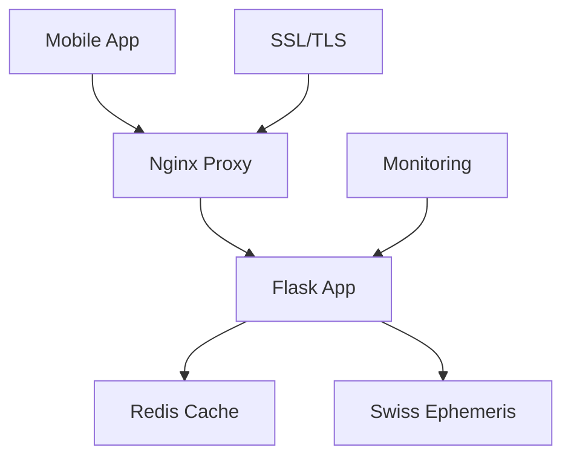

# 👥 Team Onboarding Guide - Astro Engine

## Welcome to the Astro Engine Team! 🌟

This guide will help new team members get started with the Astro Engine project quickly and efficiently.

## 🎯 Project Overview

**Astro Engine** is a high-performance astrology calculation engine designed for the **Corp Astro** mobile application ecosystem. It provides precise planetary calculations using Swiss Ephemeris data and supports multiple ayanamsa systems (Lahiri, KP, Raman).

### Key Features:
- ⚡ High-performance calculations with Redis caching
- 🌍 Multiple ayanamsa systems support
- 🤖 AI integration ready (Astro Ratan)
- 🏢 Corporate astrology focus
- 📱 Mobile app backend (GrahVani, TellMyStars)
- 🔒 Production-grade security
- 📊 Comprehensive monitoring

## 🚀 Quick Start (5 minutes)

### 1. Clone and Setup
```bash
# Clone the repository
git clone <your-repo-url>
cd Astro_Engine

# Verify deployment readiness
python3 verify_deployment.py

# Start development environment
docker-compose up -d
```

### 2. Test the API
```bash
# Health check
curl http://localhost:5000/health

# Sample calculation
curl -X POST http://localhost:5000/api/v1/lahiri/calculate \
  -H "Content-Type: application/json" \
  -d '{
    "birth_date": "1990-05-15",
    "birth_time": "14:30",
    "latitude": 28.6139,
    "longitude": 77.2090,
    "timezone": "Asia/Kolkata"
  }'
```

### 3. Access Documentation
- **Main Docs**: Open `README.md` for comprehensive documentation
- **API Reference**: Available at `http://localhost:5000/docs` (when running)
- **Deployment Guide**: See `DIGITALOCEAN_DEPLOYMENT.md`

## 👨‍💻 Development Environment Setup

### Prerequisites
- **Python 3.8+** 
- **Docker & Docker Compose**
- **Git**
- **VS Code** (recommended) with Python extension

### Local Development
```bash
# 1. Create virtual environment
python3 -m venv venv
source venv/bin/activate  # On Windows: venv\Scripts\activate

# 2. Install dependencies
pip install -r requirements.txt

# 3. Copy environment file
cp .env.development .env

# 4. Start Redis (for caching)
docker run -d -p 6379:6379 redis:alpine

# 5. Run the application
cd astro_engine
python app.py
```

### Using Docker (Recommended)
```bash
# Start full stack (app + Redis + Nginx)
docker-compose up -d

# View logs
docker-compose logs -f astro-engine

# Stop services
docker-compose down
```

## 📚 Key Documentation Files

| File | Purpose |
|------|---------|
| `README.md` | Complete project documentation (2,110 lines) |
| `DIGITALOCEAN_DEPLOYMENT.md` | Production deployment guide |
| `ASTRO_RATAN_INTEGRATION.md` | AI agent integration |
| `CORPORATE_ENDPOINTS.md` | Business-specific APIs |
| `PREDICTIVE_ALGORITHMS.md` | Advanced calculations |
| `DEPLOYMENT_STATUS.md` | Production readiness status |

## 🏗️ Project Architecture

### Core Components
```
Astro_Engine/
├── astro_engine/           # Main application
│   ├── app.py             # Flask application
│   ├── routes/            # API route handlers
│   └── calculations/      # Astrology calculations
├── ephe/                  # Swiss Ephemeris data (159 files)
├── docs/                  # Documentation
├── docker-compose.yml     # Full stack setup
├── Dockerfile             # Production container
└── deploy.sh             # Deployment script
```

### System Flow


## 🔧 Common Development Tasks

### Adding New API Endpoints
1. Create route in `astro_engine/routes/`
2. Add calculation logic in `astro_engine/calculations/`
3. Update documentation in `README.md`
4. Add tests
5. Test with `curl` or Postman

### Testing Calculations
```python
# Example: Test birth chart calculation
import requests

data = {
    "birth_date": "1990-05-15",
    "birth_time": "14:30",
    "latitude": 28.6139,
    "longitude": 77.2090,
    "timezone": "Asia/Kolkata"
}

response = requests.post(
    "http://localhost:5000/api/v1/lahiri/calculate",
    json=data
)
print(response.json())
```

### Database/Cache Operations
```bash
# Connect to Redis
docker exec -it astro_engine_redis_1 redis-cli

# View cached data
redis> KEYS *
redis> GET calculation:hash123

# Clear cache
redis> FLUSHALL
```

## 🚀 Deployment Workflow

### Development → Staging → Production

1. **Development**
   ```bash
   # Work on feature branch
   git checkout -b feature/new-calculation
   # Make changes
   git commit -am "Add new calculation method"
   git push origin feature/new-calculation
   ```

2. **Testing**
   ```bash
   # Run verification
   python3 verify_deployment.py
   
   # Test in Docker
   docker-compose up -d
   curl http://localhost:5000/health
   ```

3. **Production Deployment**
   ```bash
   # On DigitalOcean droplet
   git pull origin main
   ./deploy.sh
   ```

## 🎯 API Integration Examples

### Python Integration
```python
import requests

class AstroEngine:
    def __init__(self, base_url="https://your-domain.com"):
        self.base_url = base_url
    
    def calculate_birth_chart(self, birth_data, ayanamsa="lahiri"):
        endpoint = f"{self.base_url}/api/v1/{ayanamsa}/calculate"
        response = requests.post(endpoint, json=birth_data)
        return response.json()

# Usage
engine = AstroEngine()
chart = engine.calculate_birth_chart({
    "birth_date": "1990-05-15",
    "birth_time": "14:30",
    "latitude": 28.6139,
    "longitude": 77.2090,
    "timezone": "Asia/Kolkata"
})
```

### JavaScript/React Native Integration
```javascript
// API client for React Native
class AstroEngineAPI {
  constructor(baseURL = 'https://your-domain.com') {
    this.baseURL = baseURL;
  }

  async calculateBirthChart(birthData, ayanamsa = 'lahiri') {
    const response = await fetch(
      `${this.baseURL}/api/v1/${ayanamsa}/calculate`,
      {
        method: 'POST',
        headers: {
          'Content-Type': 'application/json',
        },
        body: JSON.stringify(birthData),
      }
    );
    return response.json();
  }
}

// Usage in React Native
const api = new AstroEngineAPI();
const chartData = await api.calculateBirthChart({
  birth_date: '1990-05-15',
  birth_time: '14:30',
  latitude: 28.6139,
  longitude: 77.2090,
  timezone: 'Asia/Kolkata'
});
```

## 🔍 Debugging & Troubleshooting

### Common Issues

#### 1. Application Won't Start
```bash
# Check logs
docker-compose logs astro-engine

# Common fixes
docker-compose down
docker-compose up --build
```

#### 2. Calculation Errors
```bash
# Check Swiss Ephemeris data
ls -la ephe/
# Should show 159 ephemeris files

# Test specific calculation
curl -X POST http://localhost:5000/api/v1/lahiri/calculate \
  -H "Content-Type: application/json" \
  -d '{"birth_date": "1990-01-01", "birth_time": "12:00", "latitude": 0, "longitude": 0, "timezone": "UTC"}'
```

#### 3. Redis Connection Issues
```bash
# Check Redis status
docker-compose ps redis

# Restart Redis
docker-compose restart redis

# Test Redis connection
docker exec -it astro_engine_redis_1 redis-cli ping
```

#### 4. Performance Issues
```bash
# Monitor performance
curl http://localhost:5000/metrics

# Check resource usage
docker stats
```

### Debug Mode
```bash
# Enable debug mode
export FLASK_ENV=development
export FLASK_DEBUG=1

# Or edit .env.development
FLASK_ENV=development
FLASK_DEBUG=True
```

## 📊 Monitoring & Metrics

### Health Checks
```bash
# Application health
curl http://localhost:5000/health

# Detailed metrics
curl http://localhost:5000/metrics

# Redis health
docker exec -it astro_engine_redis_1 redis-cli ping
```

### Log Files
```bash
# Application logs
docker-compose logs -f astro-engine

# Nginx logs (in production)
docker-compose logs -f nginx

# System logs (production)
sudo journalctl -u astro-engine -f
```

## 🏢 Corporate Astrology Features

### Business-Specific Endpoints
- `/api/v1/corporate/team-compatibility`
- `/api/v1/corporate/business-timing`
- `/api/v1/corporate/market-analysis`
- `/api/v1/corporate/partnership-analysis`

### AI Integration (Astro Ratan)
- OpenAI Assistant API integration
- Business advice generation
- Market timing predictions
- Team dynamic analysis

## 🤝 Team Collaboration

### Git Workflow
```bash
# Feature development
git checkout -b feature/description
git commit -am "Clear commit message"
git push origin feature/description
# Create Pull Request

# Code review process
# Merge after approval
```

### Communication Channels
- **Technical Issues**: GitHub Issues
- **Questions**: Team Slack/Discord
- **Documentation**: Update README.md
- **Deployment**: Coordinate with DevOps

### Code Standards
- **Python**: Follow PEP 8
- **Comments**: Document complex calculations
- **Testing**: Add tests for new features
- **Documentation**: Update relevant docs

## 🎓 Learning Resources

### Astrology Background
- Swiss Ephemeris documentation
- Ayanamsa systems comparison
- Vedic astrology fundamentals
- Corporate astrology principles

### Technical Resources
- Flask documentation
- Docker best practices
- Redis caching strategies
- API design principles

### Tools
- **Postman**: API testing collections
- **VS Code**: Python development setup
- **Docker Desktop**: Container management
- **GitHub**: Version control

## 🚨 Emergency Procedures

### Production Issues
1. **Check health endpoint**: `curl https://your-domain.com/health`
2. **View logs**: `docker-compose logs -f`
3. **Restart services**: `docker-compose restart`
4. **Contact team**: Notify in emergency channel

### Security Issues
1. **Immediate**: Block suspicious IPs
2. **Review**: Check access logs
3. **Update**: Security configurations
4. **Document**: Incident response

### Data Issues
1. **Backup**: Regular database/cache backups
2. **Restore**: From known good state
3. **Validate**: Test calculations
4. **Monitor**: Enhanced monitoring

## ✅ Onboarding Checklist

### Day 1: Setup
- [ ] Clone repository
- [ ] Set up development environment
- [ ] Run `verify_deployment.py`
- [ ] Test basic API endpoints
- [ ] Read core documentation

### Day 2-3: Understanding
- [ ] Study Swiss Ephemeris integration
- [ ] Understand ayanamsa systems
- [ ] Review calculation algorithms
- [ ] Test different API endpoints
- [ ] Explore corporate features

### Week 1: Development
- [ ] Make first small contribution
- [ ] Add/improve tests
- [ ] Update documentation
- [ ] Deploy to staging
- [ ] Complete code review

### Month 1: Advanced
- [ ] Optimize calculations
- [ ] Add monitoring/metrics
- [ ] Integrate AI features
- [ ] Performance tuning
- [ ] Production deployment

## 🎉 Welcome to the Team!

You're now ready to contribute to the Astro Engine project! Remember:

1. **Ask questions** - The team is here to help
2. **Start small** - Make incremental improvements
3. **Document everything** - Help future team members
4. **Test thoroughly** - Maintain quality standards
5. **Have fun** - Build amazing astrology features!

For immediate help, reach out to the team or create a GitHub issue.

---

**Next Steps:**
1. Complete the onboarding checklist
2. Set up your development environment
3. Make your first contribution
4. Join the team discussions

Welcome aboard! 🚀✨
